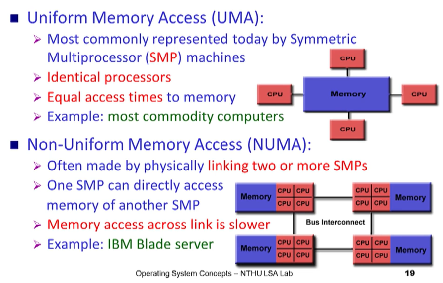

# OS ch1 筆記整理

## 🧩ainframe Systems (大型主機系統: 任務性質單純、大量處理資料)
### 🧩Batch (批次系統: 一次一批自動處理)
- user submit jobs
- Operator sort jobs
- process one job at a time

- Drawbacks:
    - One job at a time 
    - No interaction
    - CPU idle 

### 🧩Muti-programming (做完才讓出CPU)
- OS task:
    - memory management
    - CPU scheduling
    - I/O system
### 🧩Time-sharing (Multi-tasking system: time slot)
- interactive system
- multi users share the computer simultaneously
- switch job:
    - finish
    - waiting I/O
    - a short period of time

- OS task:
    - virtual memory
    - file system / disk management
    - process synchronization / deadlock

## 🧩Computer-system architecture  
- desktop system (早期單核)
- parallel system (throughput, economical)
    - symmetric multiprocessor system (SMP)
    - asymmetric multiprocessor system: one master CPU + multi slave CPUs
- distributed system
## 🧩Special-purpose Systems

